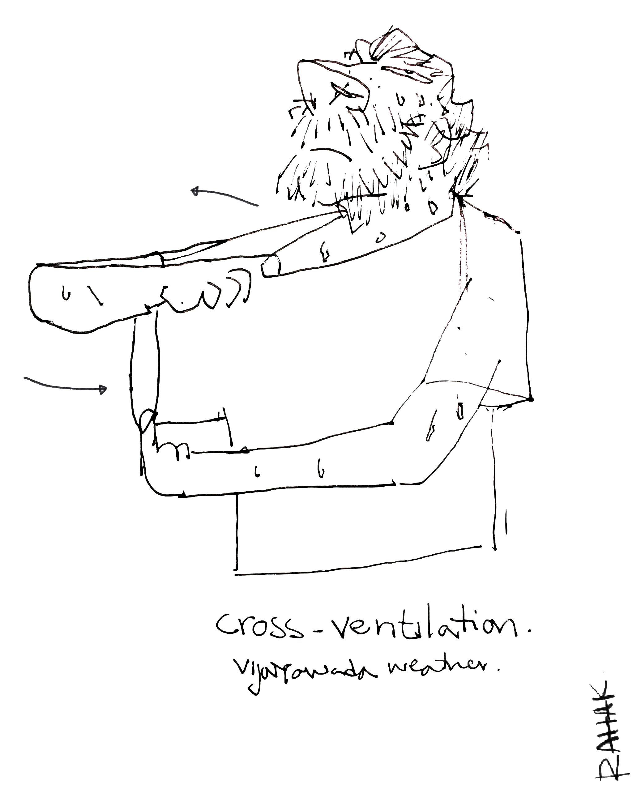

****
<h1 class="name" style="margin-top:0px;"></h1>

Hi, I'm Rahak. A designer and a creative generalist. My current interests are narratives, digital publising and systems. I am currently based in Tallinn, Estonia.
This is my blog/portfolio/digitalspace. I wish to share my thoughts and articulate them here. ⌘(ctrl) + P to download my CV!

→ {{ site.email }}  
→ {{ site.phone }}  
→ https://rahak.net 

## Work
 
 

    

         
{{ item.year }}

    

    

        
<b>{{ item.title }}</b> 
        {{ item.firm }} <a href="{{ item.url }}">{{ item.url }}</a>

        
{{ item.description }}

     



## Education

 

    

         
{{ item.year }}

    

    

        
<b>{{ item.title }}</b> <a href="{{ item.url }}">Link</a>

        
{{ item.firm }}

        
{{ item.description }}

    



## Film Festivals and Collaborations

 

    

         
{{ item.year }}

    

    

        
<b>{{ item.title }}</b> <a href="{{ item.url }}">Link</a>

    
{{ item.firm }}

        
{{ item.description }}

    



## Skills

 

    

    

    

        
<b>{{ item.title }}</b> 
        {{ item.firm }}
        {{ item.description }}

    



## Extra Curriculars and Hobbies

 

    

         
{{ item.year }}

    

    

        
{{ item.title }} 
        {{ item.firm }}
        {{ item.description }}

    



## Languages

 

    

         
{{ item.year }}

    

    

        
<b>{{ item.title }}</b> 
        {{ item.firm }}
        {{ item.description }}

    



